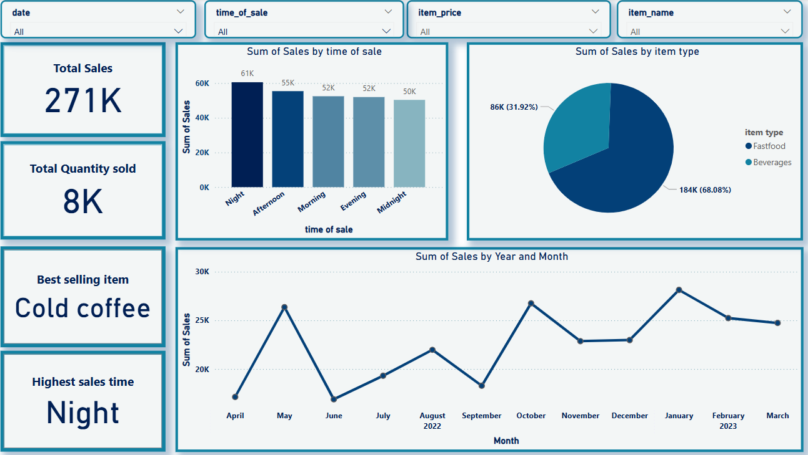
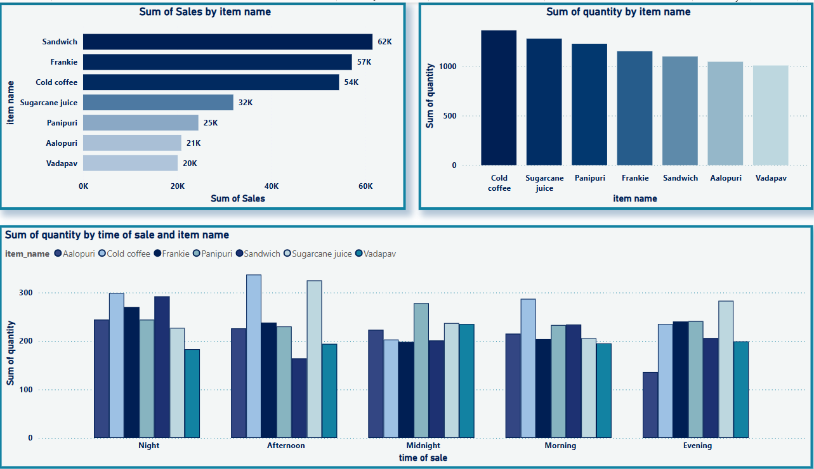

# 🧠 Restaurant sales analysis - Sales Dashboard

This project focuses on analyzing sales data using **Python** (Pandas, Matplotlib, Seaborn) and visualizing insights using **Power BI**.

## 📁 Project Structure
- `notebooks/`: Contains the Jupyter Notebook with full data analysis.
- `reports/`: Power BI dashboard with interactive insights.
- `data/`: Sample dataset.

## 🛠 Tools & Libraries
- Python
- Pandas
- numpy
- Seaborn
- Matplotlib
- Power BI

## 📊 Objectives
- Clean and preprocess the data.
- Analyze trends and patterns.
- Build an interactive dashboard to communicate findings.

## 📸 Power BI Preview

